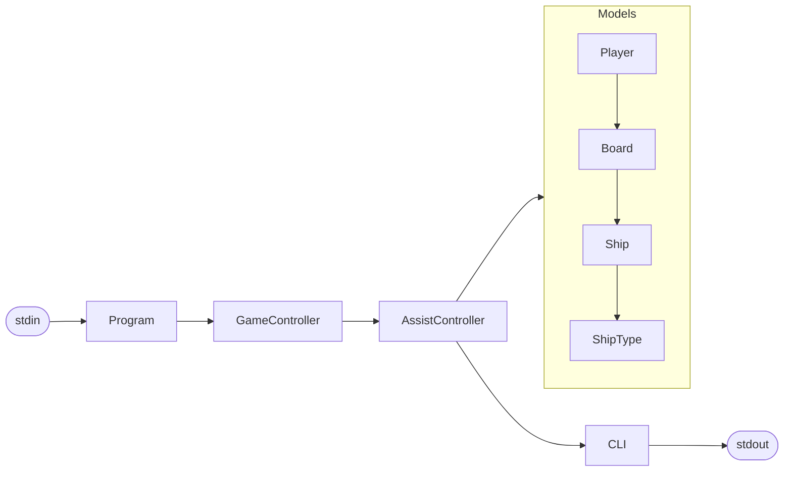

# Project Report: Battleship (Batalha Naval)

| | |
|---|---|
| Degree | Computer Engineering (Licenciatura em Engenharia Informática), [IADE](https://www.iade.europeia.pt/) |
| Year | 2024/2025, 1st year, 2nd semester |
| Course | Programação e Algoritmos (Programming and Algorithms) |
| Teaching method | Project-based learning (PBL) |
| Language | C# on .NET 8, standard library only |

## Contents

1. [Team](#1-team)
2. [Task distribution](#2-task-distribution)
3. [Solution architecture](#3-solution-architecture)
4. [Data structures](#4-data-structures)
5. [Algorithms](#5-algorithms)
6. [State and operations](#6-state-and-operations)
7. [Implemented features](#7-implemented-features)
8. [Decisions on open points](#8-decisions-on-open-points)
9. [Testing](#9-testing)
10. [How to run](#10-how-to-run)

## 1. Team

| Student | Number |
|---|---|
| Tiago Manuel Antunes Cabaça | 20241185 |
| César de Oliveira Rodrigues | 20240449 |
| Lucas Dernedde Sequeira Gomes Nicolau | 20241526 |
| Muhammad Sudeis Abdul Latif Sacoor | 20241707 |

## 2. Task distribution

| Student | Responsibilities |
|---|---|
| Tiago Cabaça | MVC structure of the solution, board and ship logic, helper functions |
| César Rodrigues | Player management: the `RJ`, `LJ` and `EJ` instructions |
| Lucas Nicolau | Ship logic: placement, removal and shots |
| Muhammad Sacoor | General validation, error messages and support code |

## 3. Solution architecture

The solution follows the Model-View-Controller pattern, which keeps the interface, the data
and the game logic apart, as the assignment requires.



### 3.1 Models

`Models/` holds the state of the game and the rules that depend only on that state.

| Class | Responsibility |
|---|---|
| `ShipType` | The five ship codes (`L`, `S`, `F`, `C`, `P`), their sizes and how many of each a fleet has |
| `Ship` | The cells a ship occupies, built from a start cell, a size and a direction, and the cells already hit |
| `Board` | One player's 10 x 10 grid: placement rules, the ships on it and the shots it has received |
| `Player` | Name, games played, victories, the board and the number of ships placed per type |

The interfaces `IShip`, `IBoard` and `IPlayer` in `Interfaces/` describe the contract of each
model, so the controllers depend on behaviour and not on implementation details.

### 3.2 Controllers

| Class | Responsibility |
|---|---|
| `GameController` | Owns the state of the session (registered players, game in progress, combat started, players in the game, whose turn it is) and sends each instruction to its handler |
| `AssistController` | One method per instruction. Each method validates the arguments, checks the error conditions in the order set by the assignment, and applies the change |

### 3.3 View

`Views/CLI.cs` is the only class that writes to the console. The models never print: the
board, for instance, builds the text of the grid and the view prints it. Every line ends in
`\n` on every operating system, so the output can be compared byte by byte with the expected
files.

### 3.4 Entry point

`Program.cs` sets the console to UTF-8, creates the `GameController` and passes it one line
at a time until it reads an empty line or the end of the input.

### 3.5 Folder layout

```text
src/BatalhaNaval
├── Program.cs
├── Controllers/   GameController.cs, AssistController.cs
├── Interfaces/    IBoard.cs, IPlayer.cs, IShip.cs
├── Models/        Board.cs, Player.cs, Ship.cs, ShipType.cs
└── Views/         CLI.cs
```

## 4. Data structures

The problem is small: two players, a fixed 10 x 10 grid and eleven ships each. The data
structures are chosen for clarity and for direct access where the rules need it.

| Structure | Where | Why |
|---|---|---|
| `List<Player>` | Registered players, in `GameController` | Few elements; easy to search by name, remove and sort for `LJ` |
| `List<Ship>` | Ships on a board | At most eleven ships; iterated to find the ship on a cell |
| `List<(int Row, int Col)>` | Cells of a ship | A ship has one to five cells, kept in order from the start cell |
| `Dictionary<ShipType, int>` | Ships placed per type, in `Player` | Constant-time check of the fleet limit for each type |
| `char[,]` | Placement grid of a board | Direct access to any cell, used by the adjacency rule |
| `HashSet<(int, int)>` | Cells shot at on a board, and cells hit on a ship | Constant-time test for a repeated shot and for a hit cell |
| `enum ShipType` | Ship codes | Turns the letter typed by the user into a type the compiler checks |

A ship keeps its full list of cells and a separate set of hit cells. Removing a cell from
the list when it is hit would make the ship forget its own shape, so a hit could no longer be
drawn on the board.

## 5. Algorithms

### 5.1 Placing a ship (`CN`)

1. Parse the ship code, the start cell and, for ships longer than one cell, the direction
   (`N`, `S`, `E` or `O`).
2. Build the list of cells from the start cell, the size of the type and the direction.
3. Check every cell: it must be inside the grid, free, and none of its eight neighbours may
   belong to another ship.
4. Check that the player still has ships of that type and ships in general to place.
5. Mark the cells on the grid and increase the counter of that type.

The check costs O(n) for a ship of n cells, since each cell looks at a fixed number of
neighbours.

### 5.2 Firing a shot (`T`)

1. Validate the game state, the shooter, the cell and the turn.
2. Reject a cell that was already shot (set lookup, O(1)).
3. Register the shot on the opponent's board and look for the ship on that cell.
4. Report a miss, a hit, a sunk ship, or the end of the game when every ship of the opponent
   is sunk. At the end, the shooter gets a victory and both players get one more game.
5. Pass the turn to the opponent.

### 5.3 Showing the result (`V`)

For each player, in alphabetical order, the program prints the number of shots, the shots
that hit a ship and the ships sunk, followed by the grid of that player's shots: `X` for a
hit and `*` for a miss.

### 5.4 Sorting players

`LJ`, `IJ` and `V` sort names alphabetically with the invariant culture, so the order is the
same on every computer, whatever its regional settings.

## 6. State and operations

### 6.1 Session state in `GameController`

| Variable | Meaning |
|---|---|
| `players` | All registered players |
| `gameInProgress` | Whether a game is running |
| `combatStarted` | Whether the shooting phase has begun |
| `activePlayer1`, `activePlayer2` | The two players of the current game |
| `currentTurn` | The player expected to shoot next, or none before the first shot |

These variables prevent instructions out of context, such as a shot before combat starts or
removing a player who is in the current game. When a game ends, by forfeit or by sinking the
whole fleet, all of them return to the initial state.

### 6.2 Operations

| Instruction | Operation |
|---|---|
| `RJ` | Registers a player, rejecting repeated names |
| `EJ` | Removes a player who is not in the current game |
| `LJ` | Lists players alphabetically with games played and victories |
| `IJ` | Starts a game between two registered players and clears their boards |
| `CN` | Places a ship, enforcing the grid, adjacency and fleet rules |
| `RN` | Removes the ship that occupies a cell, before combat |
| `IC` | Starts combat once both fleets are complete |
| `T` | Fires a shot and reports the result |
| `V` | Shows the statistics and the shots of both players |
| `D` | Ends the game by forfeit of one player (the other wins) or both (no winner) |

## 7. Implemented features

Every instruction in the assignment is implemented: `RJ`, `EJ`, `LJ`, `IJ`, `IC`, `D`, `CN`,
`RN`, `T` and `V`, with all the success and error messages and the error order defined for
each one. An unknown instruction, or a wrong number of arguments, prints
`Instrução inválida.`

## 8. Decisions on open points

The assignment does not define every situation. These are the choices made:

| Situation | Behaviour |
|---|---|
| A player shoots out of turn | `Instrução inválida.` |
| A player shoots a cell already shot | `Posição irregular.`, and the turn does not change |
| An unknown ship code | `Instrução inválida.` |
| A direction given for a one-cell ship | Ignored |
| An invalid direction, row or column in `CN` | `Posição irregular.` |
| A cell outside the grid in `RN` | `Não existe navio na posição.` |
| `D` with the same name twice | Counts as one forfeit |
| A new game with players from an earlier game | Boards and fleets start empty; statistics are kept |
| A line with only spaces | Ends the program, like an empty line |

## 9. Testing

The program is checked with input/output tests in `tests/`. Each `NN-name.in` file is fed to
the program and the output must match `NN-name.out` byte by byte. The scripts
`run-tests.sh` and `run-tests.ps1` build the project and run every test, and GitHub Actions
runs them on every push.

| Test | Covers |
|---|---|
| `01-players` | Registering, listing and removing players |
| `02-start-game` | Starting games, a second `IJ` during a game, unregistered players |
| `03-place-ships` | Valid and invalid placements |
| `04-full-fleet` | Both complete fleets and the start of combat |
| `05-combat` | Shots, turns, repeated shots, `V` and forfeit |
| `06-full-game` | A complete game until the last ship sinks, and a new game after it |
| `07-errors` | The error messages of every instruction |

## 10. How to run

With the .NET 8 SDK installed, from the root of the repository:

```bash
dotnet run --project src/BatalhaNaval
```

Type one instruction per line and an empty line to finish. To run the tests:

```bash
./run-tests.sh
```
